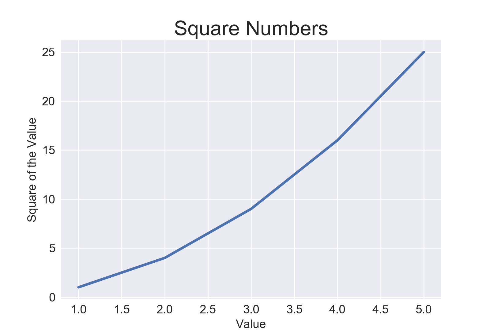
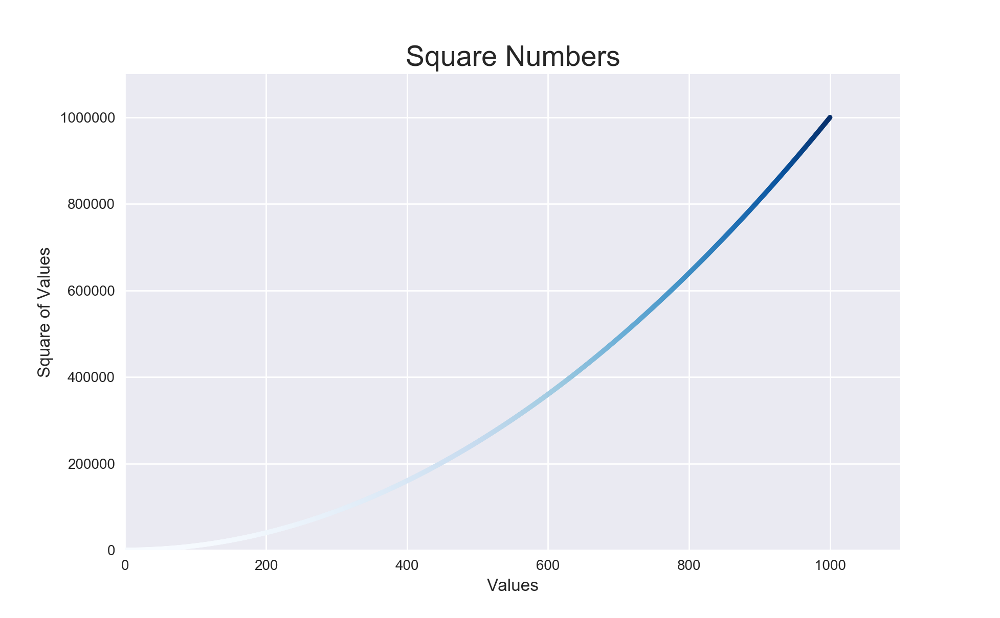
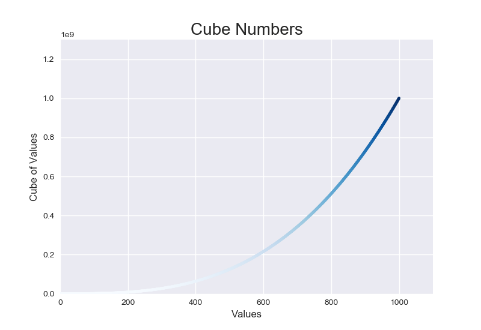
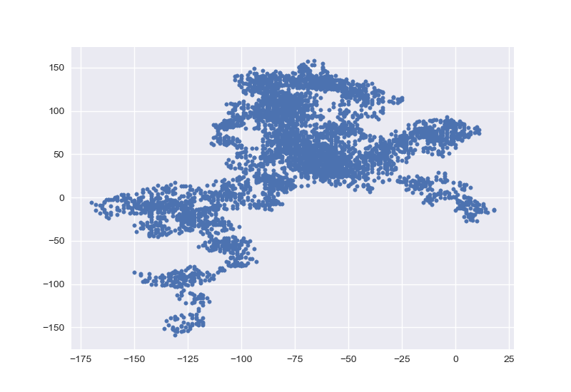
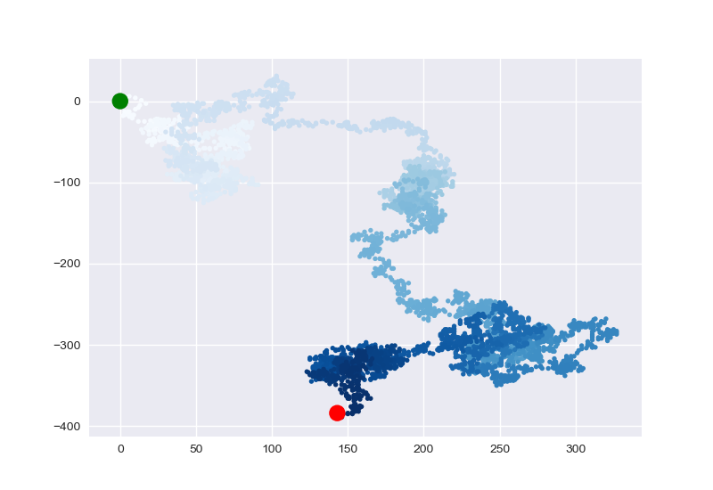
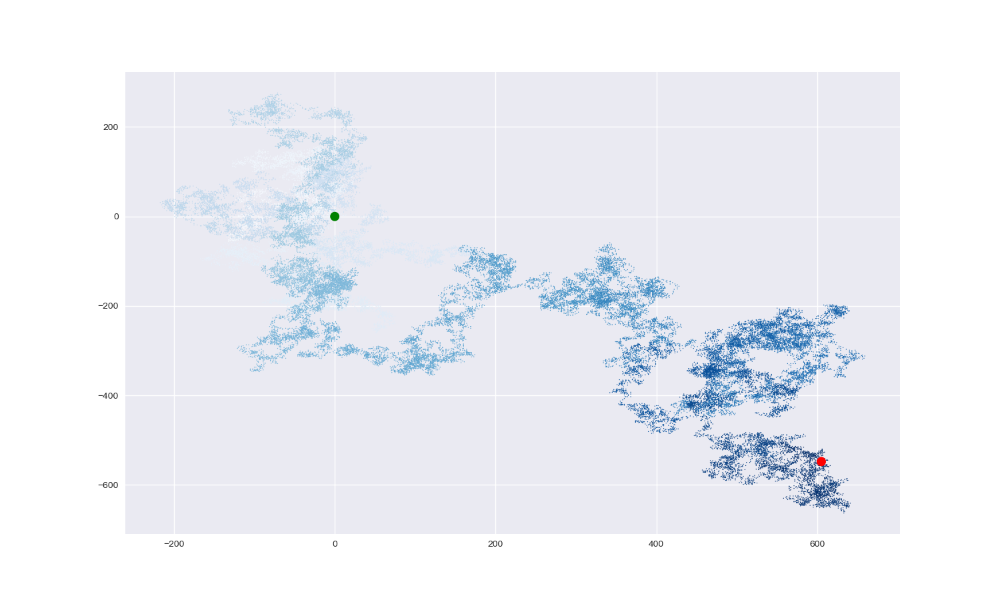

# Data-Visualization-Practice (In Progress)

From Eric Matthes project-based programming book titled "Python Crash Course", this repository is used solely as a (practice) guide to hone my <u>Python<u> Programming and Data Analytics skills.

---------------------------------------------------------------------------------------------------------------

Here you will find several data visualization techniques ranging from basic line graphs to advanced-artsy charts. This repository will also be used in my future projects as I dive deeper into data sciences. 

---------------------------------------------------------------------------------------------------------------

### Part 1: Linegraphs

This portion of the data visualization section was quite short as it served as an introduction to the rest of the chapter.

---------------------------------------------------------------------------------------------------------------

### Part 2: Scatter-Series Plots

This section shows a series of points after writing a line of code that calculates data automatically by squaring and cubing values. At the end of this section, I implement Color Maps to show a gradient change in the data.

 

---------------------------------------------------------------------------------------------------------------

### Part 3: Random Walk (Scatter Plots)

Using the Random and Choice libraries in Python, the charts you see below are a progression of the first scatter plots created to the last, as each chart became increasingly more artistic and contained more and more data.

 

 

---------------------------------------------------------------------------------------------------------------

### Part 4: Rolling Dice with Plotly (Work in Progress)
